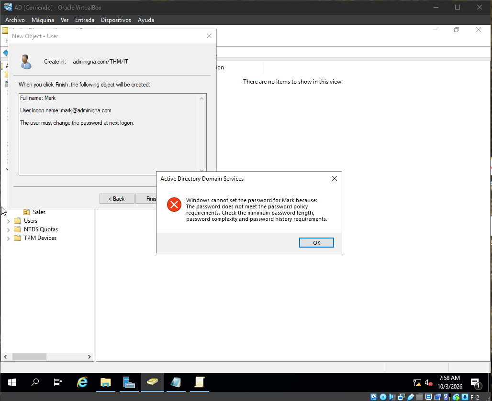
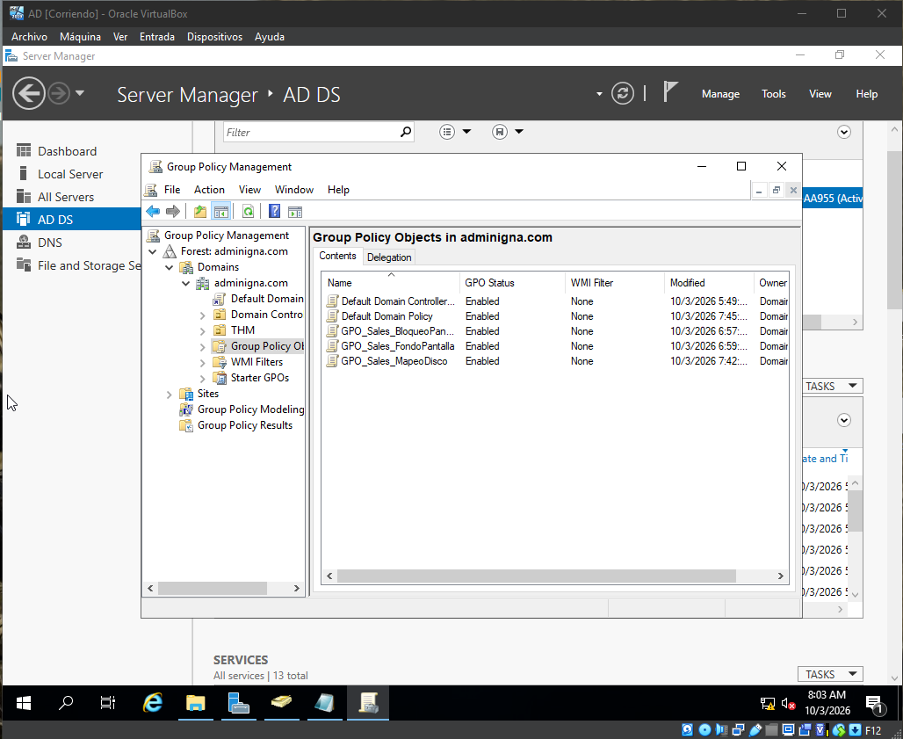
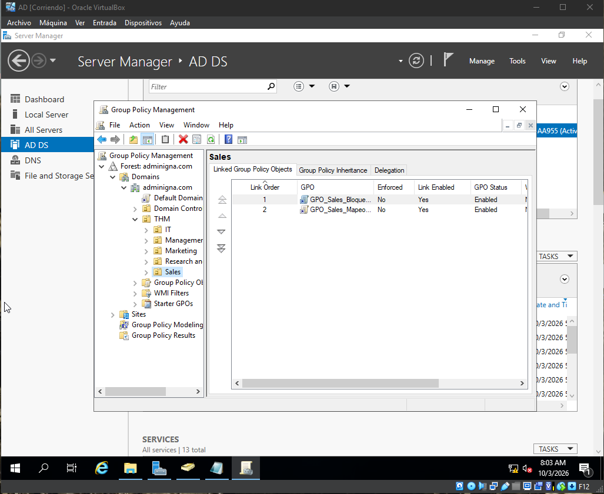
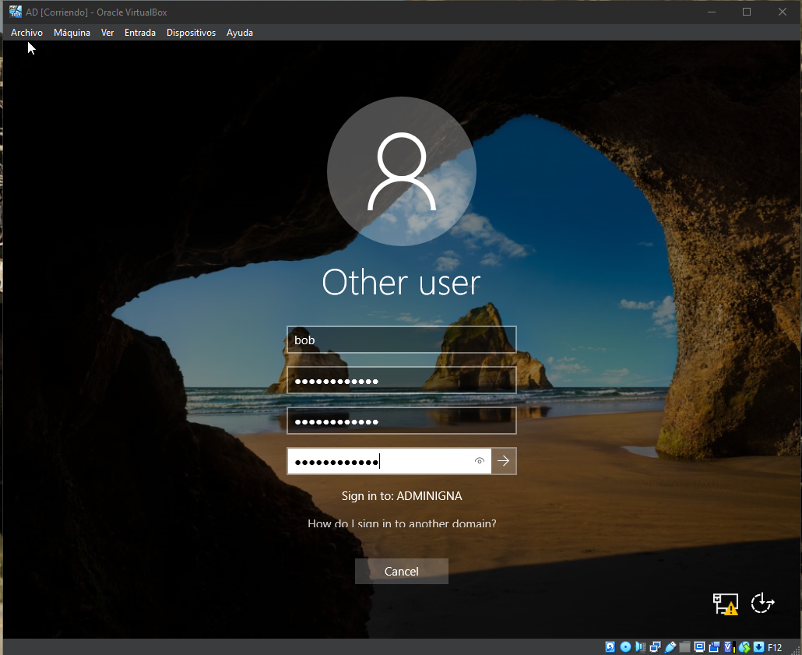
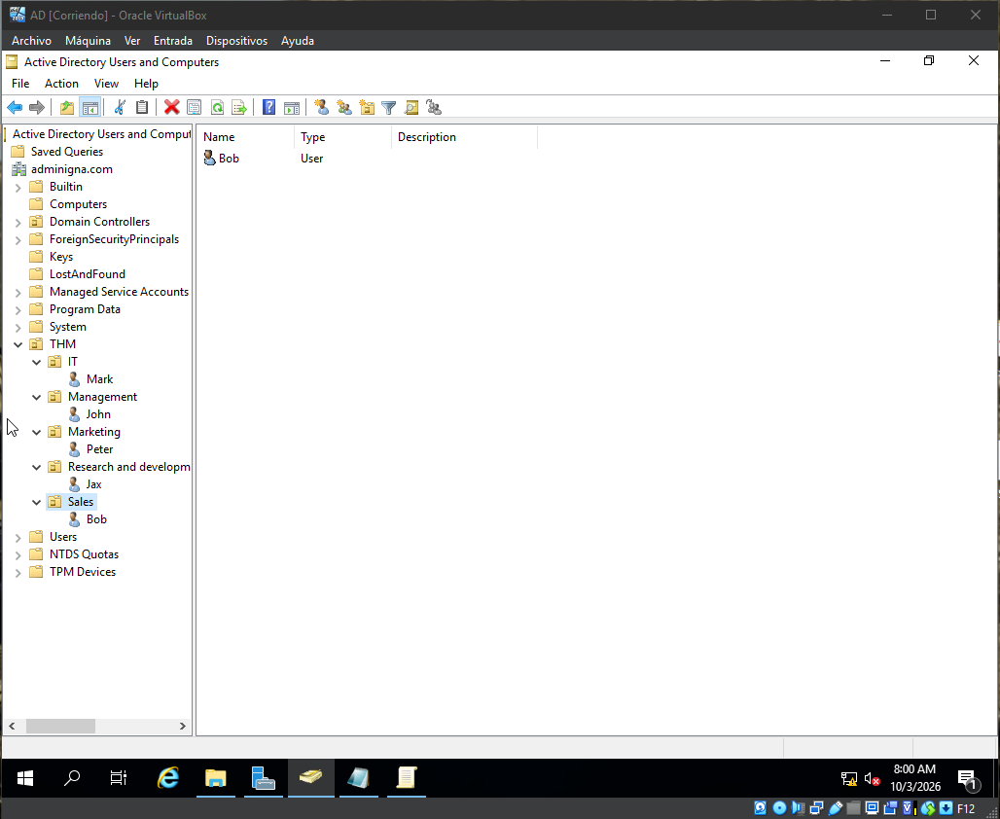

# Homelab: Active Directory Infrastructure & Enterprise Security Policies (Windows Server 2019)

Welcome to my Homelab repository! Below you will find the complete project documentation in both **English** and **Spanish**, including a step-by-step breakdown of the verified architecture.

¡Bienvenido a mi repositorio de Homelab! A continuación encontrarás la documentación completa del proyecto tanto en **inglés** como en **español**, incluyendo un desglose paso a paso de la arquitectura verificada.

---

## 🇺🇸 ENGLISH DOCUMENTATION

### 📌 Project Overview
This project involves the design, deployment, and administration of a simulated corporate environment within a local laboratory (Homelab). A Domain Controller was configured using **Windows Server 2019 (AD DS)** hosted on **Oracle VirtualBox**. The core objective was to structure the organization's identity, enforce central security baselines, and implement the **Principle of Least Privilege (PoLP)** through delegated controls and Group Policies (GPOs).

### 🏗️ Environment Architecture

#### 1. Infrastructure Components
* **Hypervisor:** Oracle VirtualBox (Network configured via **Internal Network** `intnet` using Expert Mode).
* **Domain Controller (DC):** Windows Server 2019 Standard (Domain: `adminigna.com`).
* **Identity Baseline:** Active Directory Domain Services (AD DS).

#### 2. Organizational Unit (OU) & Departmental Structure
A hierarchical OU tree was designed inside the root folder **`THM`** to mirror a real-world enterprise infrastructure:
* 🏢 **adminigna.com**
  * 📁 **THM** (Root Management OU)
    * 📁 **IT** (Technical Support, Network Admins, Help Desk) -> *Contains user: Mark*
    * 📁 **Management** (Executive Board & Management) -> *Contains user: John*
    * 📁 **Marketing** (Marketing Department) -> *Contains user: Peter*
    * 📁 **Research and development** (R&D Department) -> *Contains user: Jax*
    * 📁 **Sales** (Sales Department) -> *Contains user: Bob*

---

### 🛠️ Implemented Configurations & GPOs

#### 1. Password Complexity Restrictions (Domain-Wide)
Configured at the `Default Domain Policy` level to harden the security posture against brute-force attacks:
* **Password Complexity Requirements:** Enabled. Forces users to combine uppercase, lowercase, numbers, and special symbols.
* **Security Enforcement:** Active Directory strictly rejects any attempt by helpdesk staff or users to set passwords that do not comply with the minimum corporate parameters.

#### 2. Departmental Group Policy Objects (GPOs)
* **GPO_Sales_BloqueoPanelControl:** Complete lockout of the Control Panel and PC Settings for standard users in the Sales OU, mitigating unauthorized local configuration changes.
* **GPO_Sales_MapeoDisco:** Automatically maps a centralized corporate shared storage resource to local drive letter `S:\` for Sales personnel upon login.
* **GPO_Sales_FondoPantalla:** Enforces a standardized corporate desktop background across departmental workstations.

---

### 📸 Visual Evidence & Architecture Validation

#### Screenshot 1: Password Policy Enforcement
Active Directory Domain Services prevents the creation of the user `Mark` because the assigned password does not meet the complexity, history, or minimum length parameters established in the global GPO. This confirms the security policies are active and blocking weak credentials.

#### Screenshot 2: Active Group Policy Objects (GPOs)
Overview of the **Group Policy Management** console showing the custom GPOs successfully created in the domain (`GPO_Sales_BloqueoPanelControl`, `GPO_Sales_FondoPantalla`, and `GPO_Sales_MapeoDisco`). All statuses are marked as **Enabled**.

#### Screenshot 3: GPO Targeting and Link Order
Validation of the **Sales** OU showing that departmental GPOs are linked properly. The inheritances and link execution orders ensure that restrictions and drive mappings target Sales users exclusively.

#### Screenshot 4: Domain Authentication Test
Authentication terminal in a workstation showing a domain login attempt. The field explicitly indicates **"Sign in to: ADMINIGNA"** using the corporate user account `bob`, proving network resolution and AD authentication are working natively.

#### Screenshot 5: Directory Structure and Active Users
View of the **Active Directory Users and Computers** console. It validates the structural organization inside the `THM` parent OU, showing the logical separation of departments and the provisioning of staff accounts (`Mark`, `John`, `Peter`, `Jax`, `Bob`).

---

## 🇪🇸 DOCUMENTACIÓN EN ESPAÑOL

### 📌 Descripción del Proyecto
Este proyecto consiste en el diseño, despliegue y administración de un entorno empresarial simulado dentro de un laboratorio local (Homelab). Se configuró un controlador de dominio utilizando **Windows Server 2019 (AD DS)** bajo el hipervisor **Oracle VirtualBox**, estructurando la identidad de la organización y aplicando el **Principio de Menor Privilegio (PoLP)** junto con políticas de automatización y seguridad centralizada.

### 🏗️ Arquitectura del Entorno

#### 1. Componentes de Infraestructura
* **Hipervisor:** Oracle VirtualBox (Red configurada vía **Red Interna** `intnet` desbloqueada mediante el Modo Experto).
* **Controlador de Dominio (DC):** Windows Server 2019 Standard (Dominio: `adminigna.com`).
* **Base de Identidad:** Servicios de Dominio de Active Directory (AD DS).

#### 2. Estructura de Unidades Organizativas (OUs) y Departamentos
Se diseñó un árbol jerárquico de OUs dentro de la raíz **`THM`** para reflejar la estructura de una corporación real:
* 🏢 **adminigna.com**
  * 📁 **THM** (OU Raíz de la Organización)
    * 📁 **IT** (Soporte Técnico, Administradores) -> *Usuario: Mark*
    * 📁 **Management** (Gerencia y Dirección) -> *Usuario: John*
    * 📁 **Marketing** (Departamento de Marketing) -> *Usuario: Peter*
    * 📁 **Research and development** (Investigación y Desarrollo) -> *Usuario: Jax*
    * 📁 **Sales** (Departamento de Ventas) -> *Usuario: Bob*

---

### 🛠️ Configuraciones Implementadas y GPOs

#### 1. Restricciones de Complejidad de Contraseñas (Todo el Dominio)
Configurada a nivel de `Default Domain Policy` para robustecer la postura de seguridad contra ataques de fuerza bruta:
* **Requisitos de complejidad:** Habilitado. Obliga el uso de mayúsculas, minúsculas, números y caracteres especiales.
* **Cumplimiento de Seguridad:** Active Directory rechaza automáticamente cualquier intento de asignar contraseñas débiles que no cumplan con los parámetros mínimos corporativos.

#### 2. Objetos de Directiva de Grupo (GPOs) Departamentales
* **GPO_Sales_BloqueoPanelControl:** Bloqueo total del acceso al Panel de Control y Configuración del Sistema para usuarios comunes de Ventas, mitigando modificaciones locales no autorizadas.
* **GPO_Sales_MapeoDisco:** Configuración automatizada de asignación de unidades para mapear el almacenamiento compartido centralizado en la letra local `S:\` al iniciar sesión.
* **GPO_Sales_FondoPantalla:** Aplica un fondo de pantalla institucional obligatorio y estandarizado en los equipos del departamento.

---
*Project designed and managed for educational purposes and professional development in Systems Engineering and IT Security. / Proyecto diseñado con fines educativos y de desarrollo profesional en Ingeniería de Sistemas y Seguridad IT.*
